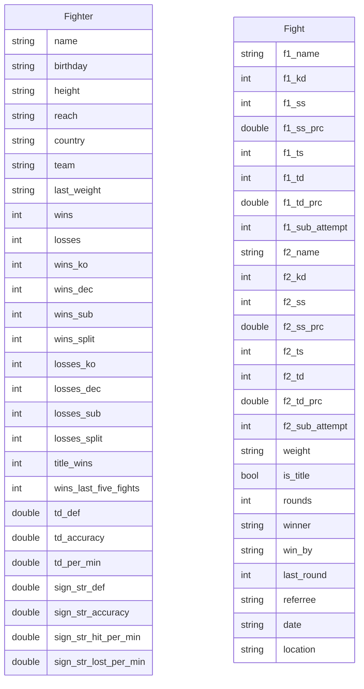

## ER

```mermaid
erDiagram
Fighter {
    string name
    string birthday
    string height
    string reach
    string country
    string team
    string last_weight
    int wins
    int losses
    int wins_ko
    int wins_dec
    int wins_sub
    int wins_split
    int losses_ko
    int losses_dec
    int losses_sub
    int losses_split
    int title_wins
    int wins_last_five_fights
    double td_def
    double td_accuracy
    double td_per_min
    double sign_str_def
    double sign_str_accuracy
    double sign_str_hit_per_min
    double sign_str_lost_per_min    
}
Fight {
	string f1_name
	int f1_kd
	int f1_ss
	double f1_ss_prc
	int f1_ts
	int f1_td
	double f1_td_prc
	int f1_sub_attempt
	string f2_name
	int f2_kd
	int f2_ss
	double f2_ss_prc
	int f2_ts
	int f2_td
	double f2_td_prc
	int f2_sub_attempt
	string weight
	bool is_title
	int rounds
	string winner
	string win_by
	int last_round
	string referree
	string date
	string location
}
```
