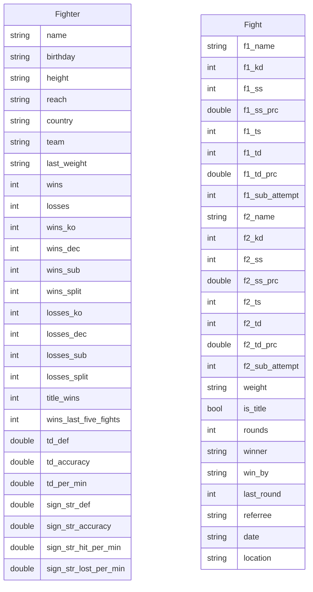

## Data collection README

## Model parameters

- Age 
- Height 
- Reach 
- Country
- Team
- Wins 
- Losses 
- Wins by KO+TKO
- Wins by decision
- Wins by submission
- Lossess by KO+TKO
- Lossess by submissions
- Lossess by decision
- Takedown defence
- Takedown accuracy
- Takedown avg per minute
- Sign.strikes defence
- Sign.strikes accuracy
- Sign.strikes hit per minute
- Sign.strikes losted per minute

## Data needed at this moment

- Normal Weight
- Last 5 fights ratio W/L 
- Last fight result 
- Career age
- Max round in career
- Total rounds in career
- Max sign. strikes hitted in career
- Max sign. strikes misess in career
- Title wins
- Title defences
- Wins by split decision
- Lossess by split decision

## ER

